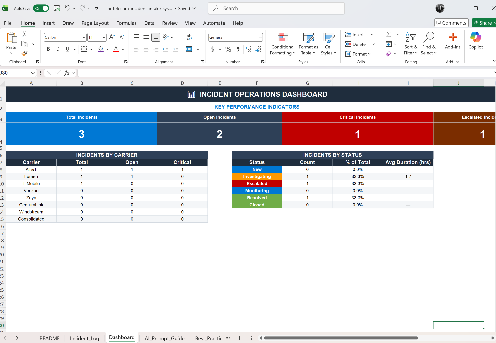
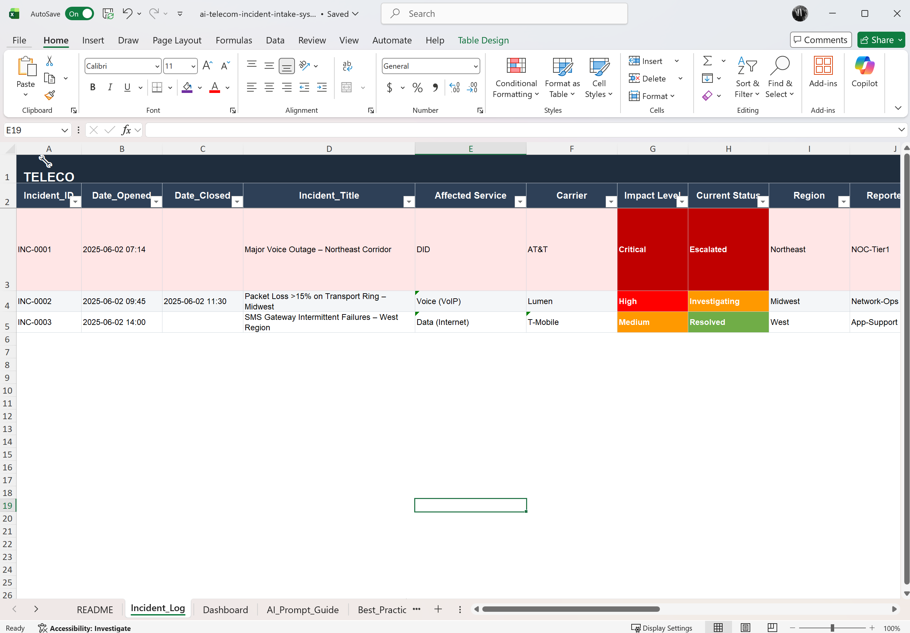

# AI Incident Intake & Response System

## Overview
This project focuses on improving incident response by standardizing how incidents are captured and using AI to generate immediate summaries, actions, and escalation paths.

## Problem
In many operational environments, the first 30–60 minutes of an incident are wasted due to:
- Incomplete or inconsistent intake data
- Back-and-forth communication between teams
- Lack of clear ownership and next steps

This delays resolution and increases operational risk.

## Solution
This system introduces:
- A structured incident intake template (Excel-based)
- Standardized fields for consistent data capture
- AI-generated incident summaries and recommended actions
- Clear ownership and status tracking

## System Components
- Incident Intake Template (Excel)
- AI Prompt Framework
- Incident Summary & Action Generator
- Status Tracking and Ownership Model

## Example Workflow
1. Incident reported and logged in a structured intake form
2. Data is captured with required fields
3. Intake is passed into an AI prompt workflow
4. AI generates:
   - Executive summary
   - Immediate next steps
   - Potential root causes
   - Escalation recommendations
5. Assigned owner executes and updates status

## Current Build

✅ Excel-based Incident Intake & Tracking System  
✅ Real-time Operations Dashboard (KPIs, Carrier & Status Views)  
✅ AI-Assisted Incident Summary & Escalation Guidance  
⬜ Automation Layer (planned – API / Python integration)

---

## Next Steps

- Integrate API-based incident ingestion (ServiceNow / webhook simulation)
- Automate incident enrichment and AI summary generation
- Add SLA breach detection and alerting logic
- Expand dashboard with trend analysis and historical reporting

## Goal
Reduce incident response time, improve clarity, and eliminate inefficiencies during the critical early stages of incident management.

## Real-World Use Case

This system is designed for telecom operations teams managing:
- Voice outages (VoIP, SIP, DID)
- Carrier escalations (AT&T, Lumen, T-Mobile, Verizon)
- SLA-driven incident response environments

Example scenario:
A critical voice outage impacts DID traffic in a region.  
This system enables:
- Rapid intake and categorization
- Structured escalation guidance
- Real-time visibility for leadership

## Dashboard Preview

## Incident Log

## About Me

I am a Technical Program Manager with a telecom background, building systems that improve incident response, operational visibility, and cross-team coordination.

This project reflects real-world challenges I’ve managed and how I approach solving them using structured workflows and AI.

